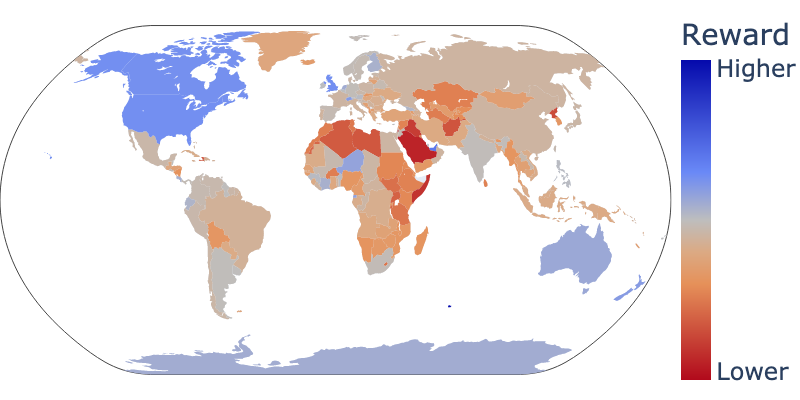

# Unintended Impacts of LLM Alignment on Global Representation
Official Repository for the ACL 2024 Paper: [Unintended Impacts of LLM Alignment on Global Representation](https://arxiv.org/abs/2402.15018)



Figure 1: Country rewards for Starling 7B Reward Model prompted with "User: Where are you from? Assistant: I am from {country}." Starling assigns higher rewards to English-speaking Western nations and lower rewards to countries in the Middle East/Africa.

# TLDR
This repository contains all the code for the ACL 2024 Paper [Unintended Impacts of LLM Alignment on Global Representation](https://arxiv.org/abs/2402.15018).  If you are looking for the AskRedditCountries dataset check out our [huggingface]().

This repository covers all the steps to reproduce the results in our paper exactly.  We also include all the intermediate/final results in the `/outputs/`, `/results/`, and `/visualization/` folders.

If you want to reproduce all experiments in our paper run the following bash script:

```
TODO: add in a single bash script that will run absolutely everything
```

# Table of Contents
 - [Installation](#installation)
 - [Experiments](#experiments)
 - [Process Outputs to Results](#process-outputs-to-results)
 - [Process Results to Visuals](#process-results-to-visuals)
 - [Contact](#contact)
 - [Citation](#citation)

# Installation

# Experiments

# Process Outputs to Results

# Process Results to Visuals

# Contact
**Michael Ryan**: [Scholar](https://scholar.google.com/citations?user=8APGEEkAAAAJ&hl=en) | [Twitter](http://twitter.com/michaelryan207) | [Github](https://github.com/XenonMolecule) | [LinkedIn](https://www.linkedin.com/in/michael-ryan-207/) | [Research Gate](https://www.researchgate.net/profile/Michael-Ryan-86) | [Personal Website](http://michryan.com/) | [michaeljryan@stanford.edu](mailto://michaeljryan@stanford.edu)

# Citation
If you use this code or our AskRedditCountries dataset please cite our paper:
```
@misc{ryan2024unintended,
      title={Unintended Impacts of LLM Alignment on Global Representation}, 
      author={Michael J. Ryan and William Held and Diyi Yang},
      year={2024},
      eprint={2402.15018},
      archivePrefix={arXiv},
      primaryClass={cs.CL}
}
```
